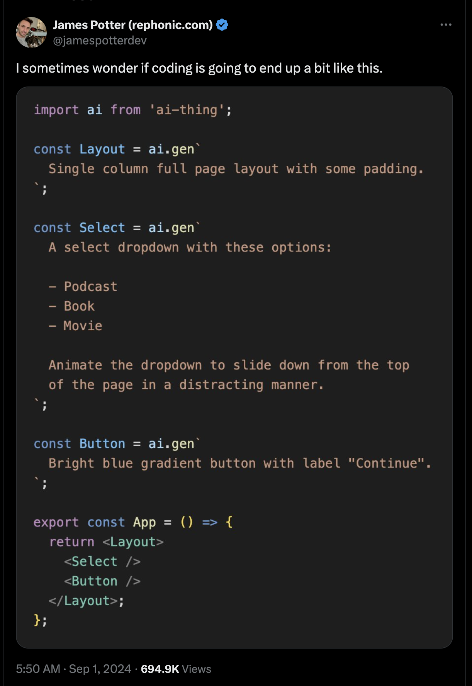

# AI Component Generator

This project is an AI-powered React component generator that uses OpenAI's GPT model to create and modify React components based on natural language prompts.
Inspired by this [tweet](https://x.com/jamespotterdev/status/1830181400408133893)


## Features

- Generate React components from text descriptions
- Iterate and modify existing components using natural language instructions
- Command-line interface for easy use


## Installation

```bash
npm install -g ai-component
```

## Usage

### Initialize the project

```bash
ai-component init
```

### Generate a new component

```bash
ai-component generate ComponentName
```

### Iterate on an existing component

```bash
ai-component iterate ComponentName "New description or instructions"
```
